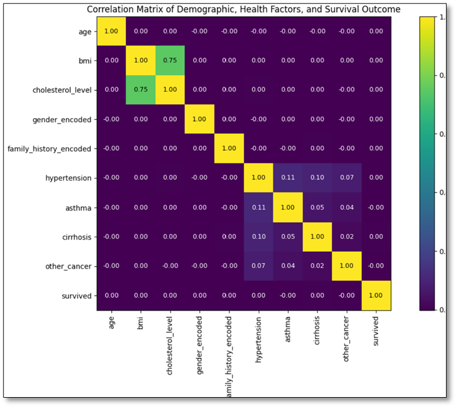

# FINAL CAPSTONE PROJECT

**"LUNG CANCER SURVIVAL ANALYSIS"**

**Tools: BigQuery, GoogleColab, Power BI and GitHub**

## 1. Project Overview

This project focuses on analyzing a synthetic lung cancer dataset to identify patterns and build a predictive model of patient survival. The dataset includes demographic, lifestyle, clinical, and treatment-related variables such as age, gender, country, diagnosis date, cancer stage, family history, smoking status, BMI, cholesterol level, hypertension, asthma, cirrhosis, other cancer, treatment type, and survival outcome.The project will be divided into two main parts. 
The first part will focus on pattern analysis using exploratory data analysis, review of missing values, value counts, histograms, bar charts, correlation analysis, scatter plots, cross-tabulation analysis, and feature engineering. This section will help examine how the variables are distributed, how they relate to each other, and whether certain patient groups show different survival patterns.
The second part will focus on predictive modeling. The target variable will be `survived`, where 0 denotes patients who did not survive, and 1 denotes patients who survived. The model will use demographic, lifestyle, clinical, treatment-related, and engineered features to evaluate whether these variables can predict patient survival. Since the target variable is imbalanced, the model will be evaluated using classification metrics such as the confusion matrix, precision, recall, F1-score, and ROC-AUC instead of accuracy alone.
Because the dataset is synthetic and is not based on real United States or Utah clinical records, the results will be interpreted for educational and exploratory purposes only.
The project is not intended to make medical conclusions or clinical recommendations. Instead, it demonstrates how BigQuery, Python, data visualization, feature engineering, and machine learning techniques can be applied to a healthcare dataset and later adapted to real public health or clinical data.

## 2.	Problem Statement

Lung cancer remains one of the most significant public health issues in the United States because it affects many people each year and continues to be one of the leading causes of cancer-related death. According to the American Cancer Society, lung cancer is estimated to account for 226,650 new cases and 124,730 deaths in the United States. In addition, SEER reports that lung and bronchus cancer remains the leading cause of cancer death in the country, with a mortality rate of 30.2 deaths per 100,000 people based on 2020–2024 data.
This issue is also relevant at the state level. Although Utah has lower lung cancer rates than the national average, the disease remains an important public health concern. The State Cancer Profiles report states that Utah’s lung and bronchus cancer incidence rate was 25.0 per 100,000 between 2018 and 2022, compared with 52.5 per 100,000 nationally. For mortality, Utah’s rate was 15.5 per 100,000 between 2019 and 2023, compared with 31.5 per 100,000 nationally. These differences show that lung cancer continues to affect patients and families in Utah, making survival-related patterns important to study.
The dataset used in this project is a synthetic lung cancer dataset created for educational and analytical purposes. Therefore, the results should not be interpreted as direct clinical evidence about lung cancer patients in the United States, Utah, or any specific population. However, the project remains valuable because it demonstrates how data analysis and machine learning techniques can be applied to a healthcare dataset. In the future, this workflow could be adapted to real public health or clinical datasets from sources such as the CDC, SEER, state cancer registries, or healthcare organizations.
This project investigates whether demographic, lifestyle, clinical, and treatment-related variables can help identify patterns and predict survival outcomes. The analysis focuses on patient characteristics such as age, sex, smoking status, family history, BMI, cholesterol level, cancer stage, pre-existing health conditions, and treatment type. The main goal is to determine whether these variables show meaningful patterns related to survival.
The motivation for this project is to practice a complete data analytics workflow using a relevant healthcare topic. The first part of the project focuses on exploratory data analysis, data cleaning, feature engineering, visualizations, correlation analysis, scatter plots, and cross-tabulations. The second part focuses on predictive modeling, using `survived` as the target variable, where 0 indicates patients who did not survive and 1 indicates those who did.
One important challenge is that the target variable `survived` is imbalanced, with a larger percentage of patients who did not survive. For this reason, the models are not evaluated solely on accuracy. Instead, metrics such as precision, recall, F1-score, confusion matrix, and ROC-AUC are used to better understand model performance, especially for the survived class.

## 3.	Research Questions

### **3.1 Pattern Analysis Questions**

1. How are demographic, lifestyle, clinical, and treatment-related variables distributed in the lung cancer dataset?
2. What relationship exists between BMI and cholesterol level among lung cancer patients?
3. How does survival outcome vary by cancer stage and treatment type?
4. Do smoking status and family history show different patterns in cancer stage or survival outcome?
5. Are pre-existing health conditions associated with survival outcomes?

### **3.2 Predictive Modeling Questions**

1. Can demographic, lifestyle, clinical, treatment-related, and engineered variables predict patient survival outcome?
2. Which variables contribute the most to predicting survival outcome?
3. How does the imbalance in the target variable `survived` affect model performance?
4. How well does the predictive model perform using classification metrics beyond accuracy?
5. Does feature engineering improve the predictive model or make the results easier to interpret?

## 4.	Dataset Description

This project uses the Lung Cancer Dataset from Kaggle, published by Khwaish Saxena and available at https://www.kaggle.com/datasets/khwaishsaxena/lung-cancer-dataset, and then uploads it to Google BigQuery for analysis. It is a synthetic source created for educational and analytical purposes and should not be interpreted as real clinical patient data. The file contains approximately 890,000 rows and 17 columns, with each record representing one lung cancer patient. It includes demographic, lifestyle, clinical, treatment-related, and outcome variables, such as age, gender, cancer stage, smoking status, BMI, cholesterol level, health conditions, treatment type, and survival. These variables support exploratory analysis, visualizations, cross-tabulations, correlation analysis, and feature engineering.

### Dataset Variables

| Feature | Data Type | Variable Category | Description |
|---|:---:|:---:|:---:|
| id | Numerical / Identifier | Administrative | Unique patient identifier. |
| age | Numerical | Demographic | Patient age. |
| gender | Categorical | Demographic | Patient gender. |
| country | Categorical | Demographic | Country associated with the patient record. |
| diagnosis_date | Date | Clinical | Date when the patient was diagnosed with lung cancer. |
| cancer_stage | Categorical | Clinical | Stage of lung cancer, such as Stage I, Stage II, Stage III, or Stage IV. |
| family_history | Boolean / Categorical | Risk Factor | Indicates whether the patient has a family history of cancer. |
| smoking_status | Categorical | Lifestyle | Patient smoking category, such as current smoker, former smoker, passive smoker, or never smoked. |
| bmi | Numerical | Health Indicator | Body Mass Index of the patient. |
| cholesterol_level | Numerical | Health Indicator | Patient's cholesterol level. |
| hypertension | Binary Numerical | Comorbidity | Indicates whether the patient has hypertension. |
| asthma | Binary Numerical | Comorbidity | Indicates whether the patient has asthma. |
| cirrhosis | Binary Numerical | Comorbidity | Indicates whether the patient has cirrhosis. |
| other_cancer | Binary Numerical | Comorbidity | Indicates whether the patient has another type of cancer. |
| treatment_type | Categorical | Treatment | Type of treatment the patient received. |
| end_treatment_date | Date | Treatment | Date when the treatment ended. |
| survived | Binary Numerical | Target Variable | Survival outcome: 0 represents did not survive, and 1 represents survived. |

### **4.1 Important Terminology**

*Cancer stage: this variable describes the stage of lung cancer at the time of diagnosis. The dataset includes Stages I, II, III, and IV. In general, cancer stage is used to describe how advanced the cancer is.

*Survived: the main target variable for the predictive model. In this project, survived = 0 denotes patients who did not survive, and survived = 1 denotes patients who did.

*BMI: Body Mass Index. It is a numerical health indicator calculated from a person’s weight and height. In this project, BMI is used to classify body weight into general categories: underweight, normal, overweight, and obese.

*Cholesterol level: This variable represents the patient’s cholesterol level. It is used to explore whether cholesterol patterns are associated with BMI, comorbidities, cancer stage, or survival outcomes.

*Family history: Indicates whether the patient has a family history of cancer. In the original dataset, this variable represents a Yes/No concept. In BigQuery and Python, it may appear as a Boolean value: True means the patient has a family history, and False means the patient does not.

*Smoking status: This variable describes the patient’s smoking category, such as current smoker, former smoker, passive smoker, or never smoked. It is important because smoking is commonly associated with lung cancer risk.

*Comorbidity: An additional health condition a patient has alongside the main disease being studied. In this project, a new variable called has_comorbidity will be created to indicate whether a patient has at least one additional condition, such as hypertension, asthma, cirrhosis, or another cancer.

*Treatment type: This variable indicates the type of treatment the patient received, such as chemotherapy, radiation, surgery, or a combination. It will be used to analyze survival patterns by treatment category.

### **4.2 Iimitations and Considerations**

The main limitation of this project is that the Lung Cancer Dataset is synthetic and was created for educational and analytical purposes. Therefore, the results should not be interpreted as real clinical evidence or used to make medical, treatment, or public health decisions. The data are not based on verified medical records from the United States, Utah, or any specific hospital system. Another important consideration is that several variables appear highly balanced or artificially structured, including gender, family history, cancer stage, and smoking status. In addition, the strong relationship between BMI and cholesterol level may reflect how the synthetic data was generated rather than a real-world clinical pattern.

The target variable `survived` is also imbalanced, with a larger percentage of patients labeled as not surviving. Because of this, model performance should not be evaluated using accuracy alone. Metrics such as precision, recall, F1-score, confusion matrix, and ROC-AUC are needed to better assess prediction quality.
Despite these limitations, the data are appropriate for this final project because they are large, well-structured, and suitable for analysis in BigQuery. The project supports exploratory analysis, visualization, cross-tabulation, feature engineering, and predictive modeling, while also serving as a foundation for future work using real clinical or public health data from sources such as cancer registries or healthcare organizations.

## 5.	Methodology and Data Preparation

This project followed a structured workflow for data analytics and machine learning to analyze a synthetic lung cancer dataset. The methodology included data collection, data loading, data preparation, exploratory data analysis, pattern analysis, feature engineering, predictive modeling, dashboard development, and final reporting. First, the data were downloaded from Kaggle as a CSV file and uploaded into Google BigQuery. The original table was preserved as lung_cancer, while a prepared version, lung_cancer_cleaned, was created for analysis and modeling. The data were then imported into Google Colab using Python, where the first rows, data structure, data types, and missing values were reviewed. Since no missing values were found in the selected columns, no rows or columns were removed.
Exploratory analysis was performed using histograms, bar charts, value counts, and summary statistics to understand numerical and categorical variables. Correlation analysis and a scatter plot were used to examine relationships among variables, particularly the strong pattern between BMI and cholesterol levels. Cross-tabulation analysis was also used to compare categorical variables such as cancer stage, treatment type, smoking status, family history, comorbidity status, and survival outcome. Feature engineering was applied to create variables such as gender_encoded, family_history_encoded, bmi_group, cholesterol_group, and has_comorbidity. These variables supported both the pattern analysis and the predictive modeling stages.
Finally, predictive models were built with survival as the target variable, where 0 indicates patients who did not survive and 1 indicates those who did. Because the target variable was imbalanced, the models were evaluated using a confusion matrix, precision, recall, F1 Score, and ROC-AUC rather than accuracy alone. Power BI was then used to create dashboards that summarized the main exploratory findings, patterns, and model results. Since the data are synthetic, the results are interpreted for educational and exploratory purposes only, not as real medical evidence or clinical recommendations.

## 6.	Analysis and Findings

 **6.1	Numerical Variable Patterns**

The numerical variable analysis focused on `age`, `bmi`, and `cholesterol_level` using descriptive statistics and histograms. The results showed that the dataset includes patients across a wide age range, with many observations concentrated among middle-aged and older adults. BMI values were distributed across the normal, overweight, and obese ranges, while cholesterol levels showed a broad range. These findings provided an initial understanding of the patients’ health-related characteristics.

### Numerical Variable Summary

| Statistic | Age | BMI | Cholesterol Level |
|---|---:|---:|---:|
| Count | 890,000 | 890,000 | 890,000 |
| Mean | 55.01 | 30.49 | 233.63 |
| Standard Deviation | 9.99 | 8.37 | 43.43 |
| Minimum | 4.00 | 16.00 | 150.00 |
| 25% | 48.00 | 23.30 | 196.00 |
| 50% / Median | 55.00 | 30.50 | 242.00 |
| 75% | 62.00 | 37.70 | 271.00 |
| Maximum | 104.00 | 45.00 | 300.00 |

### Age Distribution

  

### BMI Distribution

  

### Cholesterol Level  Distribution

  

**6.2 Categorical Variable Patterns**

The categorical variable analysis showed that several variables were almost evenly distributed. Gender was nearly balanced, with 50.02% male patients and 49.98% female patients. Family history also showed a similar balance, with 50.02% of patients having no family history and 49.98% having a family history of cancer. The country distribution was also highly even among the top countries, with each of the top 10 countries representing approximately 3.71% to 3.75% of the dataset.
In contrast, some health-related variables showed bigger differences between categories. Hypertension was present in 75.00% of patients, while 25.00% did not have hypertension. Asthma was more evenly distributed, with 53.03% of patients without asthma and 46.97% with asthma. Cirrhosis was less common, occurring in 22.60% of patients, whereas other cancers were present in only 8.82%.
The survival outcome variable was imbalanced. A total of 77.98% of patients were labeled as not surviving, while 22.02% were labeled as surviving. This imbalance is important because it can affect predictive modeling. For this reason, model performance should be evaluated using metrics such as confusion matrices, precision, recall, F1-score, and ROC-AUC rather than relying solely on accuracy.
Overall, the categorical analysis suggests that some variables, such as gender, family history, and country, are highly balanced, which may reflect the dataset's synthetic structure. However, health-related variables such as hypertension, cirrhosis, other cancers, and survival outcome show more noticeable differences across categories.

### Categorical Variable Summary

| Variable | Category | Count | Percentage |
|---|---|---:|---:|
| gender | Male | 445,134 | 50.02% |
| gender | Female | 444,866 | 49.98% |
| family_history | False | 445,181 | 50.02% |
| family_history | True | 444,819 | 49.98% |
| hypertension | 1 | 667,521 | 75.00% |
| hypertension | 0 | 222,479 | 25.00% |
| asthma | 0 | 471,931 | 53.03% |
| asthma | 1 | 418,069 | 46.97% |
| cirrhosis | 0 | 688,899 | 77.40% |
| cirrhosis | 1 | 201,101 | 22.60% |
| other_cancer | 0 | 811,540 | 91.18% |
| other_cancer | 1 | 78,460 | 8.82% |
| survived | 0 | 693,996 | 77.98% |
| survived | 1 | 196,004 | 22.02% |

**6.3 Correlation Matrix**

The correlation matrix shows that the strongest relationship in the dataset is between BMI and cholesterol_level, with a correlation value of 0.75. This indicates a strong positive relationship, meaning that patients with higher BMI values also tend to have higher cholesterol levels.
Most of the other variables show very weak or near-zero correlations. Variables such as do not show strong linear relationships with the survival outcome. The correlation between the selected variables and survived is close to 0, suggesting that survival outcome is not strongly explained by simple linear relationships in this dataset.
There are also weak positive correlations among some comorbidity variables. For example, hypertension has a small positive correlation with asthma, cirrhosis, and other_cancer, but these values are low and do not indicate strong relationships. Overall, the correlation matrix suggests that while BMI and cholesterol levels are strongly related, the selected variables do not exhibit strong linear correlations with the survival outcome. This finding helps explain why the predictive models later showed weak performance when trying to predict survived.

### Correlation Matrix

  

**6.4 BMI and Cholesterol Relationship**

The scatter plot between BMI and cholesterol level supports the correlation matrix results. The graph shows two clear clusters: patients with a BMI below 30 tend to have cholesterol levels between approximately 150 and 240, while those with a BMI above 30 tend to have levels between approximately 240 and 300. This pattern suggests a strong positive relationship between BMI and cholesterol level in the dataset. However, the clear separation between the two clusters may also reflect the data's synthetic structure. 

### BMI vs Cholesterol

  

**6.5 Cross Tabulation Analysis**

These calculations were performed because variables such as treatment_type, cancer_stage, smoking_status, family_history, hypertension, asthma, and cirrhosis are categorical or binary variables. For these types of variables, correlation analysis is not always sufficient or easy to interpret. Therefore, cross-tabulation was used to compare percentages across groups and identify possible patterns.
The normalize="index" option was used to calculate percentages within each category. For example, in the comparison between treatment_type and survived, each treatment type accounts for 100%. This makes it easier to compare whether one treatment type has a higher or lower survival percentage without the interpretation being affected by differences in group size.
The results showed that survival percentages were very similar across treatment types and cancer stages. All treatment categories had survival rates close to 22%, with surgery showing the highest survival percentage at 22.15% and chemotherapy the lowest at 21.87%. Similarly, cancer stages showed very small differences, ranging from 21.81% survived in Stage I to 22.14% in Stage IV. These results suggest that neither treatment type nor cancer stage showed a strong visible association with survival outcome in this synthetic dataset.
Smoking status was also compared with cancer stage, and the results showed that all smoking groups were almost evenly distributed across Stage I, Stage II, Stage III, and Stage IV, with percentages close to 25% in each stage. Family history and health conditions such as hypertension, asthma, and cirrhosis also showed minimal differences in survival outcomes, with survival percentages remaining close to the overall dataset pattern. Overall, the cross-tabulation analysis suggests that most categorical and health-related variables do not show strong patterns with the survival outcome. This supports the later predictive modeling results, which showed weak performance in predicting `survived`.

### Cross-Tabulation Results

| **Analysis**                    | **Category** | **Did Not Survive (%)** | **Survived (%)** | **Key Finding**                                                                                                                            |
| ------------------------------- | ------------ | ----------------------: | ---------------: | ------------------------------------------------------------------------------------------------------------------------------------------ |
| **Treatment Type vs. Survival** | Chemotherapy |                   78.13 |            21.87 | Survival rates are consistent across treatment types, indicating no substantial difference in outcomes.                                    |
| **Treatment Type vs. Survival** | Combined     |                   77.99 |            22.01 | Combined therapy follows the overall survival distribution observed in the dataset.                                                        |
| **Treatment Type vs. Survival** | Radiation    |                   77.94 |            22.06 | Radiation therapy shows survival rates comparable to other treatment options.                                                              |
| **Treatment Type vs. Survival** | Surgery      |                   77.85 |            22.15 | Surgery has the highest survival percentage, although the improvement is minimal.                                                          |
| **Cancer Stage vs. Survival**   | Stage I      |                   78.19 |            21.81 | Survival rates remain relatively stable across all cancer stages.                                                                          |
| **Cancer Stage vs. Survival**   | Stage II     |                   77.91 |            22.09 | No significant survival variation is observed between stages.                                                                              |
| **Cancer Stage vs. Survival**   | Stage III    |                   77.95 |            22.05 | Survival outcomes closely match the overall dataset pattern.                                                                               |
| **Cancer Stage vs. Survival**   | Stage IV     |                   77.86 |            22.14 | Stage IV shows a slightly higher survival rate, but the difference is not meaningful.                                                      |
| **Family History vs. Survival** | False        |                   78.03 |            21.97 | Family history does not appear to have a meaningful impact on survival.                                                                    |
| **Family History vs. Survival** | True         |                   77.92 |            22.08 | Survival rates are nearly identical for patients with and without a family history.                                                        |
| **Hypertension vs. Survival**   | No           |                   77.98 |            22.02 | Hypertension status does not appear to influence survival outcomes.                                                                        |
| **Hypertension vs. Survival**   | Yes          |                   77.98 |            22.02 | Survival percentages are identical regardless of hypertension status.                                                                      |
| **Asthma vs. Survival**         | No           |                   77.91 |            22.09 | Patients without asthma show a marginally higher survival rate.                                                                            |
| **Asthma vs. Survival**         | Yes          |                   78.06 |            21.94 | The survival difference associated with asthma is negligible.                                                                              |
| **Cirrhosis vs. Survival**      | No           |                   78.02 |            21.98 | Patients without cirrhosis have survival rates consistent with the overall dataset.                                                        |
| **Cirrhosis vs. Survival**      | Yes          |                   77.83 |            22.17 | Patients with cirrhosis show a slightly higher survival percentage, but the difference is too small to indicate a meaningful relationship. |

### Smoking Status vs Cancer Stage

| **Smoking Status** | **Stage I (%)** | **Stage II (%)** | **Stage III (%)** | **Stage IV (%)** | **Key Finding**                                                      |
| ------------------ | --------------: | ---------------: | ----------------: | ---------------: | -------------------------------------------------------------------- |
| **Current Smoker** |           25.05 |            24.98 |             25.11 |            24.87 | Cancer stages are almost evenly distributed among current smokers.   |
| **Former Smoker**  |           24.97 |            25.07 |             24.95 |            25.00 | No clear concentration of patients in any specific cancer stage.     |
| **Never Smoked**   |           25.03 |            24.90 |             24.95 |            25.11 | Cancer stage distribution remains balanced across all stages.        |
| **Passive Smoker** |           24.95 |            24.99 |             25.03 |            25.02 | No meaningful differences in cancer stage distribution are observed. |

### **6.6 Model Selection Rationale**

Two models were used in this project: Logistic Regression and Random Forest. Logistic Regression was selected as the baseline model because the target variable, survived, is binary: 0 indicates patients who did not survive, and 1 indicates patients who survived. This makes the problem a binary classification task. Logistic Regression is also easy to interpret and useful for understanding whether the selected variables have a linear relationship with the survival outcome.
Random Forest was selected as a second model because the exploratory analysis showed that most variables did not have strong linear relationships with survived. Since Random Forest can capture non-linear relationships and interactions between variables, it was used to evaluate whether a more flexible model could improve prediction performance. This model was also useful because it provides feature importance results, helping identify which variables contributed the most to the prediction.
Using both models allowed the project to compare a simple, interpretable baseline model with a more advanced machine learning model. This comparison helped determine whether weak model performance was due to the model choice or to the limited predictive signal in the synthetic dataset.

### **6.7 Model Results Interpretation**

**Predictive Model Results Summary**

Logistic Regression was used as the baseline model because the target variable `survived` is binary, and Random Forest was used as a more flexible model to test whether non-linear relationships could improve prediction performance. Overall, both models showed weak predictive performance. The Logistic Regression model achieved an accuracy of 0.49 and a ROC-AUC score of 0.5029. The Random Forest model slightly improved accuracy to 0.55, but its ROC-AUC remained very low at 0.5010. Since ROC-AUC values close to 0.50 indicate performance similar to random guessing, these results suggest that neither model effectively distinguished patients who survived from those who did not.

Although Random Forest performed slightly better in terms of accuracy, it was not meaningfully better overall because the ROC-AUC score did not improve. For the surviving class, both models also had low precision, meaning that many patients predicted as surviving were not correctly classified. Logistic Regression had a higher recall for the survived class, but at the cost of many incorrect survival predictions. Random Forest provided useful feature importance results, but the overall model performance remained weak.
Based on these results, the models are useful for educational and exploratory purposes but not viable for real-world clinical prediction. The weak performance suggests that the selected variables do not contain strong predictive signals for the survival outcome in this synthetic dataset. This finding is consistent with the earlier exploratory analysis, the correlation matrix, and the cross-tabulation analysis, in which most variables showed weak or minimal relationships with `survived`.

| **Model**               | **Accuracy** | **ROC-AUC** | **Precision (Survived)** | **Recall (Survived)** | **F1-Score (Survived)** |
| ----------------------- | -----------: | ----------: | -----------------------: | --------------------: | ----------------------: |
| **Logistic Regression** |         0.49 |      0.5029 |                     0.22 |                  0.52 |                    0.31 |
| **Random Forest**       |         0.55 |      0.5010 |                     0.22 |                  0.42 |                    0.29 |

### **6.8 Connection between research question and findings**

**Pattern Analysis Questions and Findings**

| **Research Question** | **Analysis Used** | **Key Findings / Answer** |
|---|---|---|
| **1. How are demographic, lifestyle, clinical, and treatment-related variables distributed in the lung cancer dataset?** | Dataset distribution review, descriptive statistics, value counts, percentage tables, histograms, and bar charts. | The dataset contains approximately 890,000 patient records and 17 original features. Numerical variables such as age, BMI, and cholesterol level showed broad distributions. Several categorical variables, including gender, family history, cancer stage, and smoking status, were relatively balanced. This balance may be useful for analysis, but it also suggests that the dataset has a synthetic structure. |
| **2. What relationship exists between BMI and cholesterol level among lung cancer patients?** | Descriptive statistics, correlation matrix, and scatter plot. | BMI and cholesterol level showed the strongest relationship in the dataset, with a correlation of approximately 0.75. The scatter plot supported this finding by showing that patients with higher BMI values generally had higher cholesterol levels. This was one of the clearest patterns identified in the analysis. |
| **3. How does survival outcome vary by cancer stage and treatment type?** | Cross-tabulation analysis using row percentages. | Survival percentages were very similar across cancer stages and treatment types. Treatment survival rates were close to 22%, with surgery showing the highest survival percentage at 22.15% and chemotherapy the lowest at 21.87%. Cancer stages also showed minimal differences, with survival ranging from 21.81% in Stage I to 22.14% in Stage IV. This suggests that neither cancer stage nor treatment type showed a strong visible association with survival outcome in this synthetic dataset. |
| **4. Do smoking status and family history show different patterns in cancer stage or survival outcome?** | Cross-tabulation analysis. | Smoking status was almost evenly distributed across cancer stages, with percentages close to 25% in each stage. Family history was also associated with almost identical survival rates between patients with and without it. These results suggest that smoking status and family history did not show strong visible patterns with cancer stage or survival outcome in this dataset. |
| **5. Are pre-existing health conditions associated with survival outcomes?** | Cross-tabulation analysis for hypertension, asthma, cirrhosis, other cancer, and has comorbidity. | Health-related variables showed minimal differences in survival outcomes. Hypertension, asthma, cirrhosis, and comorbidity status had survival percentages very close to the overall survival rate. This suggests that the selected pre-existing health conditions did not show a strong visible association with survival outcome in this synthetic dataset. |

**Predictive Modeling Questions and Findings**

| **Research Question** | **Analysis Used** | **Key Findings / Answer** |
|---|---|---|
| **1. Can demographic, lifestyle, clinical, treatment-related, and engineered variables predict patient survival outcome?** | Logistic Regression and Random Forest models. | The selected variables did not strongly predict survival outcome. Logistic Regression achieved an accuracy of 0.49 and a ROC-AUC score of 0.5029. Random Forest achieved a higher accuracy of 0.55, but its ROC-AUC score was 0.5010. Since both ROC-AUC scores were close to 0.50, the models performed nearly as well as random guessing. |
| **2. Which variables contribute the most to predicting survival outcome?** | Logistic Regression coefficients and Random Forest feature importance. | Random Forest identified variables such as BMI, age, cholesterol level, family history, gender, cirrhosis, asthma, hypertension, and other cancers as relatively important predictors. However, because the overall model performance was weak, these variables should not be interpreted as strong predictors of survival. They contributed to the model, but they did not provide sufficient predictive signal to yield reliable survival estimates. |
| **3. How does the imbalance in the target variable survived affect model performance?** | Target variable distribution and classification metrics. | The target variable was imbalanced, with 77.98% of patients labeled as did not survive and 22.02% labeled as survived. This imbalance made accuracy alone unreliable, as a model could appear useful even while mostly predicting the majority class. For this reason, precision, recall, F1-score, confusion matrix, and ROC-AUC were used to evaluate performance more accurately. |
| **4. How well does the predictive model perform using classification metrics beyond accuracy?** | Confusion matrix, precision, recall, F1-score, and ROC-AUC. | Both models showed weak performance beyond accuracy. Logistic Regression had a ROC-AUC score of 0.5029, while Random Forest had a ROC-AUC score of 0.5010. For the surviving class, Logistic Regression had a precision of 0.22, a recall of 0.52, and an F1-score of 0.31. Random Forest had a precision of 0.22, a recall of 0.42, and an F1-score of 0.29. These results show that the models had difficulty correctly identifying patients who survived. |
| **5. Does feature engineering improve the predictive model or make the results easier to interpret?** | Feature engineering, model comparison, and feature importance analysis. | Feature engineering helped organize and interpret the dataset by creating variables such as gender_encoded, family_history_encoded, bmi_group, cholesterol_group, and has_comorbidity. These variables made the dataset more useful for analysis and modeling. However, they did not substantially improve predictive performance, suggesting that the dataset has limited predictive signal for survival outcome. |

##  7.	**Main Findings**

*One of the clearest findings was the strong positive relationship between BMI and cholesterol level. The correlation matrix showed an approximately 0.75 correlation between these two variables, and the scatter plot confirmed that patients with higher BMI values generally had higher cholesterol levels. This was the strongest pattern identified in the dataset.

*The categorical and cross-tabulation analyses showed that most variables had weak or minimal differences in survival outcomes. Survival percentages were very similar across treatment types, cancer stages, family history groups, smoking status groups, and health conditions such as hypertension, asthma, and cirrhosis. For example, survival rates across treatment types were close to 22%, and cancer stages also showed very small differences in survival percentages. This suggests that the selected categorical variables did not show strong visible associations with the survival outcome in this synthetic dataset.
*The target variable "survived" was imbalanced, with 77.98% of patients labeled as "did not survive" and 22.02% labeled as "survived". This imbalance was important for the predictive modeling stage because accuracy alone could be misleading. For this reason, the models were evaluated using a confusion matrix, precision, recall, F1-score, and ROC-AUC.

*Two predictive models were tested: Logistic Regression and Random Forest. Logistic Regression achieved an accuracy of 0.49 and a ROC-AUC score of 0.5029. Random Forest improved accuracy slightly to 0.55, but its ROC-AUC score remained close to 0.50 at 0.5010. These results indicate that neither model effectively distinguished between patients who survived and those who did not. Although Random Forest provided useful feature importance results, the overall predictive performance remained weak.

*Overall, the project found that while some descriptive patterns were present, especially between BMI and cholesterol level, the selected variables did not provide strong predictive power for survival outcome. This finding is consistent across the exploratory analysis, the correlation matrix, the cross-tabulation results, and the predictive modeling results.

### **7.1 Recommendations**

Based on the results, the models developed in this project should be considered useful for educational and exploratory purposes, but not for real clinical prediction. The low ROC-AUC scores suggest that the dataset lacks sufficient predictive signal to build a reliable survival prediction model. For future analysis, it would be important to use real clinical or public health data instead of synthetic data. Real-world datasets from sources such as CDC, SEER, state cancer registries, hospitals, or healthcare organizations could provide more reliable patterns and stronger predictive relationships, also include additional clinical variables that may be more directly related to lung cancer survival, such as tumor size, cancer subtype, treatment duration, treatment response, medication history, genetic markers, laboratory results, smoking intensity, time since diagnosis, and follow-up period. These variables could provide greater predictive power than those available in the current synthetic dataset.

### **7.2 Opportunities for Future Analysis**

*Future analysis could focus on developing a more comprehensive survival prediction framework using real-world patient data and more clinically meaningful variables. Instead of only predicting whether a patient survived, future studies could analyze survival time, treatment response, disease progression, or risk groups.

*Another opportunity would be to compare synthetic data with real-world lung cancer datasets to assess how it differs from clinical patterns. This could help determine whether synthetic datasets are useful for educational modeling but limited for real-world prediction.

*Finally, future work could include more advanced feature engineering and model explainability techniques. Tools such as SHAP values or permutation importance could help explain how each variable contributes to prediction and whether the model is learning meaningful patterns.

*In conclusion, this project successfully demonstrated a complete data analytics and machine learning workflow using BigQuery, Google Colab, exploratory analysis, feature engineering, and predictive modeling. However, the results showed that the available variables in this synthetic dataset were not sufficient to build a strong survival prediction model. The main value of the project is that it identified the dataset's limitations and demonstrated how analytical methods can be used to evaluate whether healthcare-related variables contain meaningful predictive signals.

